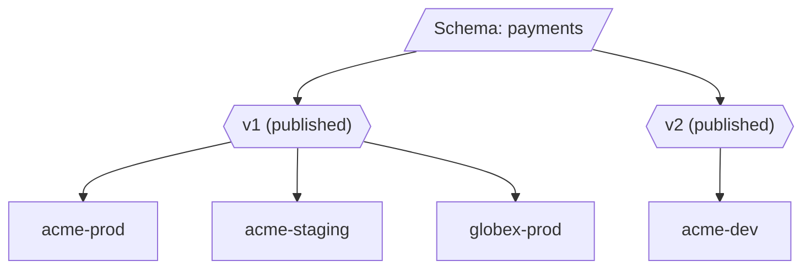

# Tenants

A **tenant** is a consumer of configuration -- an organization, environment, or service instance that has its own set of config values based on a schema.

## What Tenants Represent

Tenants are the multi-tenancy boundary in OpenDecree. Each tenant:

- Is bound to exactly one schema at a specific published version
- Has its own independent set of config values
- Has its own version history and audit trail
- Can have field-level locks restricting who can edit certain values

The tenant name is a unique slug (lowercase alphanumeric + hyphens, 1-63 characters).

## Tenants and Schemas

Every tenant is pinned to a **published schema version**. The schema defines which fields exist, their types, and their constraints. You cannot assign an unpublished (draft) schema version to a tenant.



Multiple tenants can share the same schema version. Each tenant's config values are independent -- changing config for `acme-prod` has no effect on `globex-prod`.

## One-Tenant-per-Environment Pattern

A common pattern is to create one tenant per deployment environment:

```bash
decree tenant create --name myapp-dev     --schema <id> --schema-version 1
decree tenant create --name myapp-staging --schema <id> --schema-version 1
decree tenant create --name myapp-prod    --schema <id> --schema-version 1
```

Each environment gets its own config values, version history, and audit trail. You can set aggressive values in dev, conservative values in prod, and promote config between environments using export/import:

```bash
# Export staging config and import into prod
decree config export staging-tenant-id > config.yaml
decree config import prod-tenant-id config.yaml
```

## Schema Version Pinning

When you create a tenant, you choose which schema version it uses. This is deliberate -- upgrading a tenant to a new schema version is an explicit action, not automatic.

This matters because schema versions can add, remove, or change fields. Pinning ensures:

- Running services are not surprised by new fields or removed fields
- You control when each tenant adopts schema changes
- Different tenants (e.g., dev vs. prod) can run different schema versions simultaneously

## Upgrading Schema Versions

To upgrade a tenant to a newer schema version:

```bash
decree tenant update <tenant-id> --schema-version 2
```

What happens during an upgrade:

1. The server validates that the target version is published
2. Existing config values for fields that still exist in the new version are preserved
3. New fields added in the new version start with no value (or their default, if defined)
4. Fields removed in the new version become inaccessible (but their historical values remain in the audit trail)

You can upgrade tenants one at a time -- dev first, then staging, then prod -- to safely roll out schema changes.

## Creating Tenants

Tenants are created via the CLI, SDK, or gRPC API:

```bash
decree tenant create --name acme --schema <schema-id> --schema-version 1
```

The schema ID and version must reference an existing, published schema version. The server returns the tenant ID (a UUID) which you use for all subsequent config operations.

## Multi-Tenant Access Control

Access to tenants is controlled via JWT claims or metadata headers. Each caller has a `tenant_ids` list that restricts which tenants they can access:

- **Superadmins** see all tenants and can perform any operation.
- **Non-superadmins** can only list, read, and modify tenants in their `tenant_ids` claim. Attempting to access a tenant outside this list returns `PermissionDenied`.

Tenant filtering is pushed into the database query layer, so pagination works correctly regardless of role. See [Auth](auth.md) for details.

## Listing and Inspecting Tenants

```bash
# List all tenants (superadmin sees all, others see their allowed tenants)
decree tenant list

# Get details for a specific tenant
decree tenant get <tenant-id>
```

## Related

- [Schemas & Fields](schemas-and-fields.md) -- defining the structure tenants consume
- [Versioning](versioning.md) -- how config versions work within a tenant
- [Auth](auth.md) -- role-based access and field locks per tenant
- [API Reference](../api/api-reference.md) -- full RPC details for tenant operations
- [CLI -- decree tenant](../cli/decree_tenant.md) -- tenant commands
